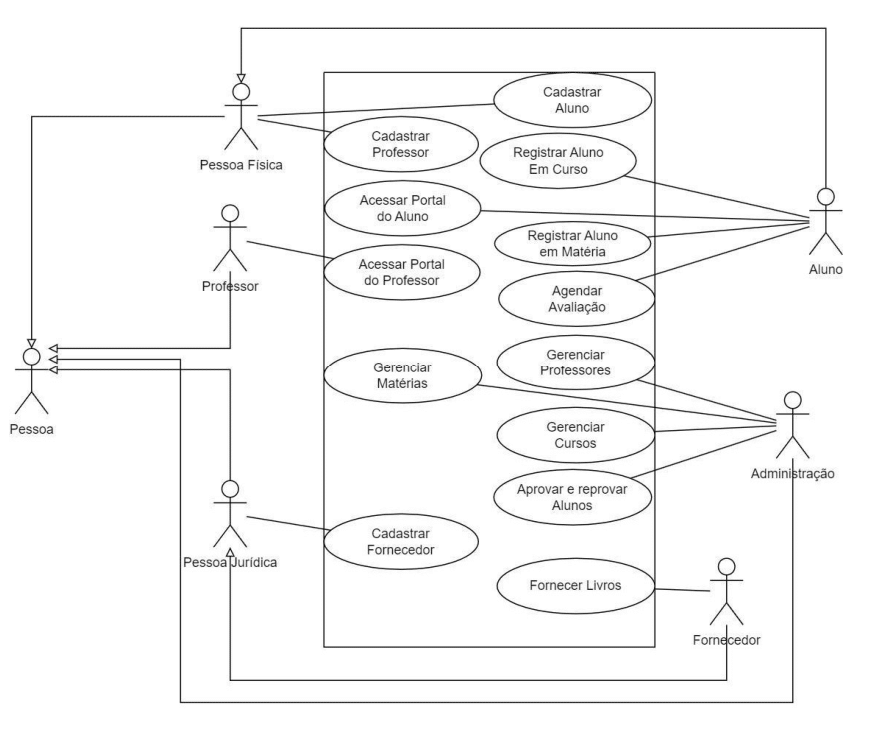
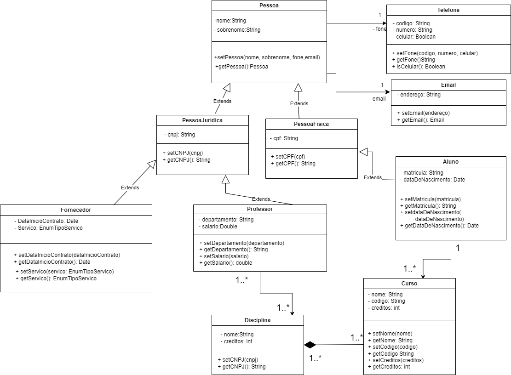

# Senac-OO_PTI
# Senac - Projeto Integrador: Desenvolvimento de Sistemas Orientado a Objetos.

# 👨‍💻 Alunos Integrantes: 👨‍💻 
[Alexandre Bertamoni Basso](https://github.com/AlexandreBasso);

[Alexandre Conte](https://github.com/AlexandreConte);

[Caio Philippo da Fonseca Gonçalves de Oliveira](https://github.com/PhilippoFGO);

[Higor Augusto de Deus](https://github.com/higoradeus);

[Rebeca da Silva Azevedo](https://github.com/rebecaaaa);

Victor de Almeida Souto Maior;

# ⭐ Descrição ⭐
Sistema para cadastro de diferentes tipos de usuário de uma instituição de ensino.

#  :open_file_folder: Diagrama de Casos de Uso :open_file_folder:

# :open_file_folder: Diagrama de Classes :open_file_folder:

# ⚙️ Linguagens Utilizadas: ⚙️
HTML, CSS3, JavaScript.
